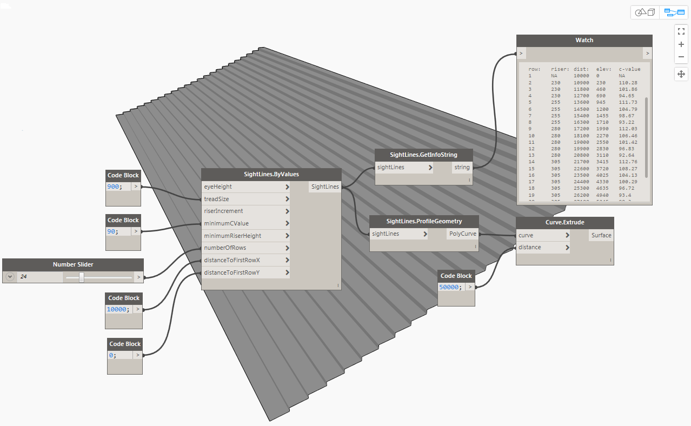
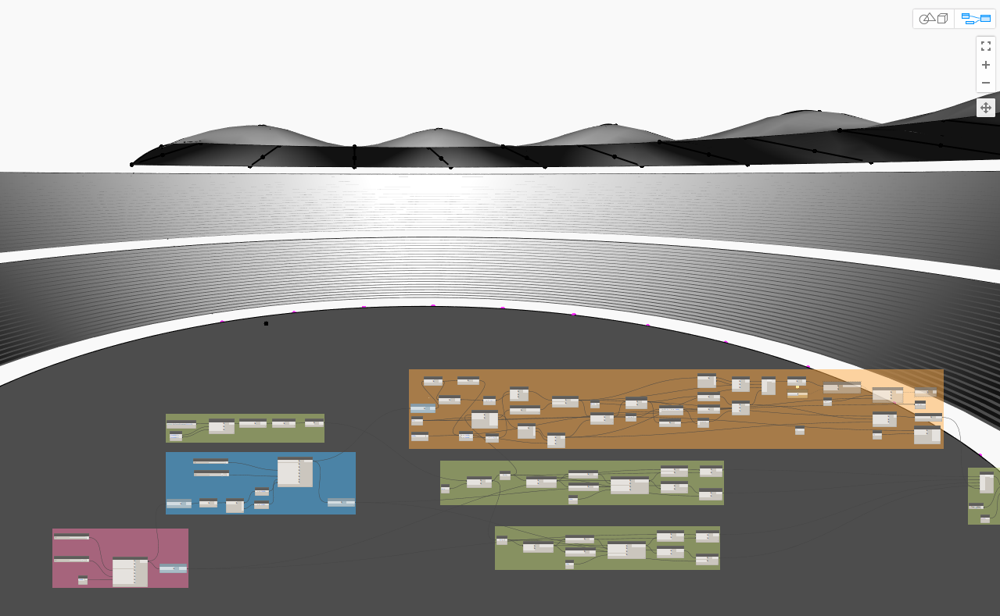

## scnodes ##
Nodes for Dynamo Visual Programming.

Current working nodes include:
 - sight-line / stadium seating nodes.
 - sheet copying nodes
 - perspective from current view.
 
 Work in progress includes:
 - parking layout creation nodes.
 - curtain wall grid editing / creation nodes.
 
 
 
 
 
 ### Building ###
 
 #### command line (cake) ####
 
 The easiest way is to use the [cake](http://cakebuild.net/ "cake") build script.
 
    git clone git@github.com:acnicholas/scnodes.git
    cd scnodes
    build.ps1

 
If you have troubles with powershell security see [http://cakebuild.net/docs/tutorials/powershell-security](http://cakebuild.net/docs/tutorials/powershell-security)

### Installing. ###

Import SCDynamoNodes.dll into you Dynamo Session (**File ---> Import Library**)

*or*

Add a the path to SCDynamoNodes.dll in the menu **Settings ---> Manage Node and Package Paths**

**TODO** create a Dynamo Package.

### Example Files ###

Example .dyn files can be found in

    scnodes/src/Test.

 
 
 